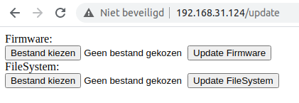

# DreamColorESP
about
-----
Control induvidually addressable LED's with ESP8266 (based on neopixel library).
A webserver is used to adjust Hue, Saturation and Brightness. 
These settings will be converted to rgb:

Effects are implemented, several are base effects copied from
the Adafruit-Neopixel site (Strandtest, RainbowChasing etc.)
You can always do a request and I will implement extra effects. 

Adjustable settings are:  

- Chip Controller (WS2811/WS2812B).
- Pixel Wiring (RGB/GRB/RGBW).
- Number of LEDs.
- Data PIN-number (default 12). 

Webserver is accessible thru Station-mode (connected with router) 
or Acces-Point-mode (direct connection).

MQTT is integrated and settings are adjustable thru mqtt-server,
command line looks lile this: 
{"EffectNum":1,"R":34,"G":55,"B":45,"Brightness":255,"Speed":50}.

MQTT-user and password can be switched on/off and are (of course)
adjustable.
MQTT-status updates are send, colors are send as rgb and hue, saturation
(for conversion I used 50% brightness), this because the webserver converts hsb 
to rgb. Status updates are send to adjustable outTopic name (default is "outTopic").

Webserver contains OTA-section, binary sketch file can be uploaded ota aswell
binary SPIFFS-file (containing HTML, CSS, and config files). Just select file
and click upload button, webserver will tell you if upload was a succes and page 
will be refreshed. 

Setup
-----
The first setup will be done thru Arduino-Ide, installation instructions for different 
platforms can be found on Arduino website.
Instructions for the ESP8266 chip to be supported by the Arduino environment can be found 
here https://github.com/esp8266/Arduino.
To upload the sketch.bin and filesystem.bin files we gonna use the "webupdater" sketch.
This sketch can be found under "examples" in the "files" section. Search for "ESP8266HTTPUpdateServer"
and scroll down to "WebUpdater". Fill in your network credentials under "your-ssid" and "your-password"
and upload sketch to ESP-device (Usb), be sure that the ESP-device settings are correct ("Tools" section). 
Important settings are "Board" and "port". After this reset your ESP. Search for the ESP-device in your 
network, you can use "Fing"(android app), "ipconfig" in command prompt under windows or "arp -a" in linux 
terminal for that. Of course you can find the device in your router's main page too. Write down the 
IP-address and open "IP-address/update" in your browser.

First upload "DreamColorESP.spiffs.bin" with "Update FileSystem" wait untill "Update Success!!" and reboot, then 
upload "DreamColorESP.ino.bin" with "Update Firmware", wait again untill update has finished. After reboot
connect to "DreamColor-ESP-01" device in your network, password is "123456789". Open "192.168.4.1" 
in your webbrowser and you will have access to "DreamColorESP" webserver. Complete setup
in "WiFi Settings" section. Now you can connect your LED-Strip and follow the steps in the "Settings"
section in the webserver. Choose PIN-number 12 on ESP8266 for DATA connection, on Arduino-boards they
use D6. Learn how to connect a LED-strip on https://learn.adafruit.com/adafruit-neopixel-uberguide/basic-connections.
I don't use an extra Capacitor nor Resistor nor Level-Shifter with an 199 Led's strip, until now no problemo. 

Have fun !!

