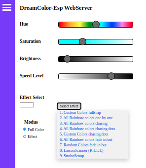

# DreamColorESP
Control WS2812b LEDs with ESP8266 (based on neopixel library).
A webserver is used to adjust Hue, Saturation and Brightness. 
These settings will be converted to rgb:

Effects are implemented, several are base effect copied from
the Adafruit-Neopixel site (Strandtest, RainbowChasing etc.)
You can always do a request for extra effects to be implemented. 

Adjustable settings are:  

- Chip Controller (WS2811/WS2812B).
- Pixel Wiring (RGB/GRB/RGBW).
- Number of LEDs.
- Data PIN-number (default 12). 

Webserver is accessible thru Station-mode (connected with router) 
or Acces-Point-mode (direct connection).

MQTT is integrated and settings are adjustable thru mqtt-server,
command line looks lile this: 
{"EffectNum":1,"R":34,"G":55,"B":45,"Brightness":255,"Speed":50}.

MQTT-user and password can be switched on/off and are (of course)
adjustable.
MQTT-status updates are send, colors are send as rgb and hue, saturation
and 50% brightness, this because the webserver converts hsb to rgb. 
Status updates are send to adjustable outTopic name (default is "outTopic").

Webserver contains OTA-section, binary sketch file can be uploaded ota aswell
binary SPIFFS-file (containing HTML, CSS, and config files). Just select file
and click upload button, webserver will tell you if upload was a succes and page 
will be refreshed. 
